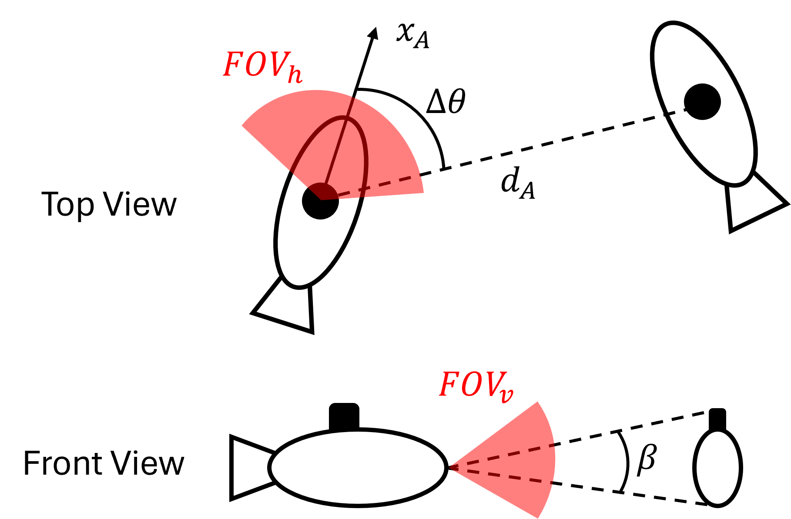
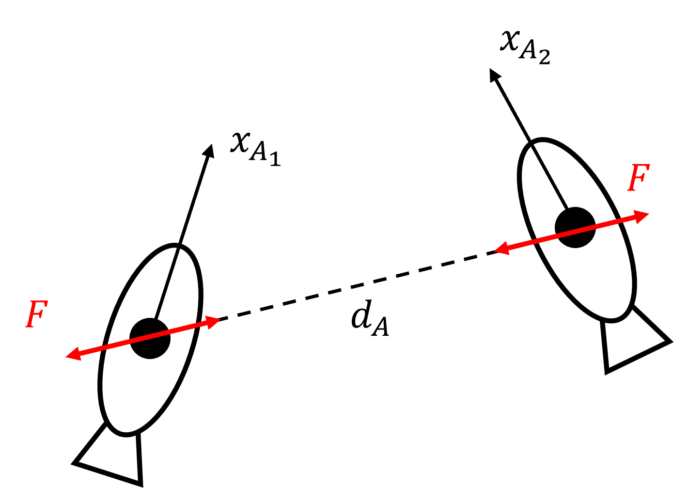

You can find link for the website [here](https://mohammedtarnini.github.io/ecce756_project/)

# ECCE 756 Robotic Perception Project

## Submitted By:
**Mohammed Tarnini**  
**100049735**

## Submitted To:
**Prof. Jorge Dias**

---

## Part A: Kalman Filter and Particle Filter Tracking on ROAD-UAE Dataset

### Kalman Filter Tracking
<video controls>
    <source src="Kalman_Filter.mp4" type="video/mp4">
    Your browser does not support the video tag.
</video>  
[Download Video](Kalman_Filter.mp4)

### Particle Filter Tracking
<video controls>
    <source src="Particle_Filter.mp4" type="video/mp4">
    Your browser does not support the video tag.
</video>  
[Download Video](Particle_Filter.mp4)

---

## Part B: Underwater Aggregation and Dispersion of AUVs using Event-based Detection

### Detecting using events from v2e toolbox (inaccurate and unusable)
<video controls>
    <source src="v2e_track_demo.mp4" type="video/mp4">
    Your browser does not support the video tag.
</video>  
[Download Video](v2e_track_demo.mp4)

### Detecting using events from SpikeCoding toolbox (more accurate and usable)
<video controls>
    <source src="SpikeCoding_track_demo.mp4" type="video/mp4">
    Your browser does not support the video tag.
</video>  
[Download Video](SpikeCoding_track_demo.mp4)

### Using Bounding Boxes: Calculating States of Detected AUVs

- \( d_A = \frac{h_A}{\beta} \)
- \( \beta = \frac{h_b}{h_f} \cdot FOV_v \)
- \( \Delta \theta = \frac{x_c}{w_f} \cdot FOV_h \)

### Lennard-Jones Potential Function

- \( V = 4\varepsilon \left[ \left( \frac{\sigma}{r} \right)^{2n} - \left( \frac{\sigma}{r} \right)^n \right] \)
- \( F = \frac{dV}{dr} = 4\varepsilon \left[ -2n\left( \frac{\sigma^{2n}}{r^{2n+1}} \right) + n\left( \frac{\sigma^n}{r^{2n+1}} \right) \right] \)

---

### Aggregation using 16 AUVs inside a square boundary
<video controls>
    <source src="Aggregation.mp4" type="video/mp4">
    Your browser does not support the video tag.
</video>  
[Download Video](Aggregation.mp4)

### Dispersion using 16 AUVs inside a square boundary
<video controls>
    <source src="Dispersion.mp4" type="video/mp4">
    Your browser does not support the video tag.
</video>  
[Download Video](Dispersion.mp4)
